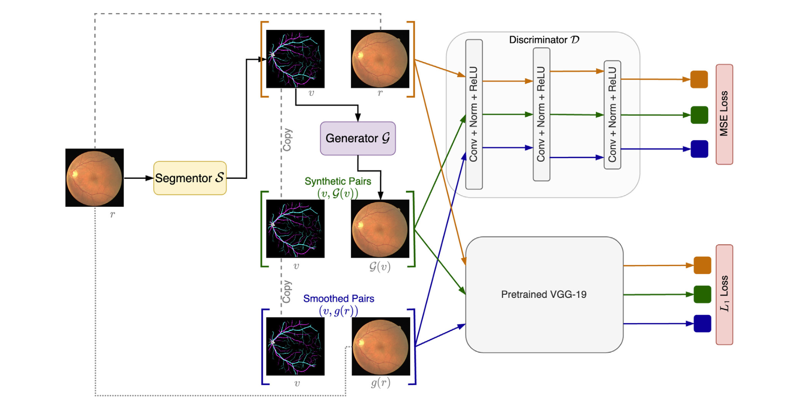
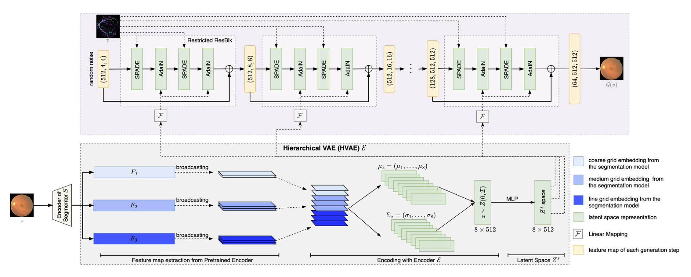

# VSG-GAN: Vessel and Style Guided Generative Adversiarl Network

A high-fidelity Image Synthesis Method with Semantic Manipulation in Retinal Fundus Image

## Architecture

|     |     |
| --- | --- | 
| The overview of VSG-GAN | The generator of VSG-GAN | 
|  |  | 
| The overview of VSG-GAN. $r$ denotes an original retinal image. Its vessel tree structure, denoted by $v$, is extracted from $r$ through the segmentor $\mathcal{S}$. Paired with the original image $r$, the generated image $\mathcal{G}(v)$ through the generator $\mathcal{G}$, and the smoothed images $g(r)$ through a Gaussian filter, three sets of image pairs, $(v, r)$, $(v, \mathcal{G}(v))$, and $(v, g(r))$, are passed into the discriminator $\mathcal{D}$ to distinguish between real and generated images, as well as into the VGG-19 model to guide the generation process in a high-level features aspect. | The generator $\mathcal{G}$ of VSG-GAN. It takes a random noise matrix as the initial input, which then undergoes successive stages of refinement through a series of Restricted ResBlocks. The latent representation extracted by the HVAE, along with the vessel segmentation $v$, are utilized in each block as conditions for the synthesis process of image $\mathcal{G}(v)$, employing normalization modules such as [AdaIN](https://arxiv.org/pdf/1703.06868) and [SPADE](https://nvlabs.github.io/SPADE/). | 


## HOWTO

*The code will be publicly open-source after they are well-documented.*

To cite:
```
@article{liu2024vsg,
  title={VSG-GAN: A High Fidelity Image Synthesis Method with Semantic Manipulation in Retinal Fundus Image},
  author={Liu, Junjie and Xu, Shixin and He, Ping and Wu, Sirong and Luo, Xi and Deng, Yuhui and Huang, Huaxiong},
  journal={Biophysical Journal},
  publisher={Elsevier}
}
```
